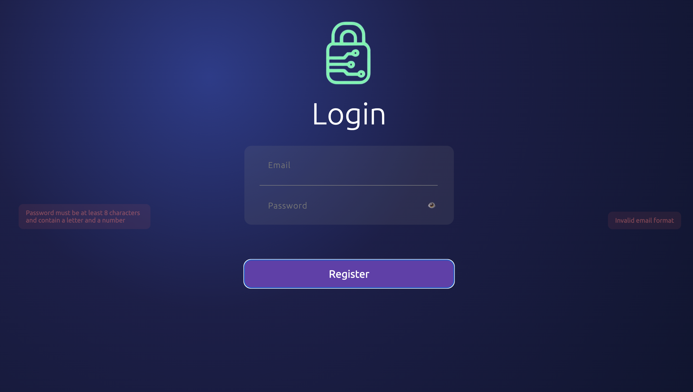
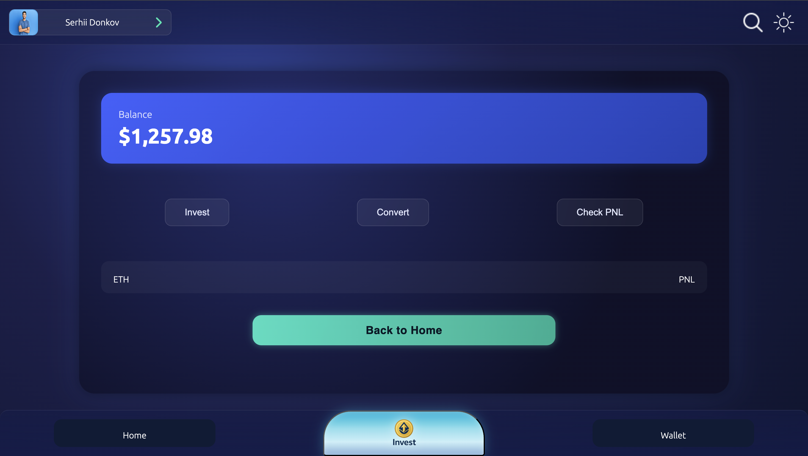
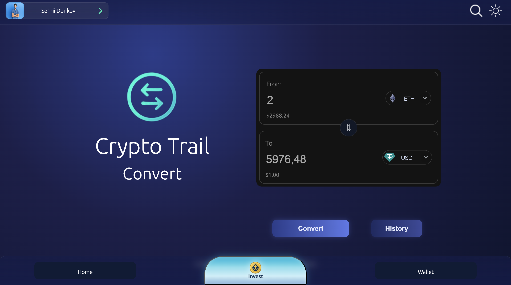

# 🚀 Crypto Trail

**Crypto Trail** is a modern personal crypto portfolio tracker designed to help users manage investments, track profit & loss (PNL), and analyze crypto assets in a clean and intuitive interface.

The project is **fully frontend-based** and does not rely on any external servers — all data is stored locally in the user’s browser.

---

## ✨ Features

### 📊 Portfolio & Investment Tracking

- Manually add crypto investments
- View current investment value
- Support for multiple tokens (BTC, ETH, USDT, BNB, etc.)

### 💰 Profit & Loss (PNL)

- Floating PNL
- Total PNL
- Real-time profit & loss calculations
- Percentage change indicators

### 🔄 Convert & Invest

- Convert USD → Crypto
- Automatic token amount calculation
- Target price multipliers (x0.7, x1, x1.5, x2, x10, etc.)
- Future profit estimation

### 🧾 Investment History

- Full investment history
- Clear record of all user actions
- Easy-to-read transaction logs

### 👤 User Profile

- Local user registration
- Random avatar generation
- Account status tracking
- Secure local session handling

### 🎨 UI / UX

- Dark / Light theme support
- Responsive layout
- Smooth gradients and glassmorphism effects
- Mobile-friendly navigation

---

## 🔐 Data & Privacy

- ❌ No backend servers
- ✅ All data stored locally using **LocalStorage**
- 🔒 Full user control over personal data

---

## 🧠 Tech Stack

- **React**
- **TypeScript**
- **Vite**
- **CSS (custom UI styling)**
- **LocalStorage**
- **React Router**

---

## 📸 Screenshots

The project includes:

- Home Dashboard
- Invest Flow
- Token Selector
- PNL & Statistics
- Wallet
- Profile Page
- Help & Support Page








---

## 🛠 Installation & Run

```bash
# clone the repository
git clone https://github.com/your-username/crypto-trail.git

# install dependencies
npm install

# start development server
npm run dev
```

## 🌐 Deployment

The project is configured for deployment on GitHub Pages using GitHub Actions.

## 🧭 Project Status

- Project is finished ✅

## 👨‍💻 Author

Crypto Trail

- Built by riderPUSH as a learning and portfolio project.

## ⭐️ Support

- If you like this project, consider giving it a ⭐️
- Your support is greatly appreciated!
